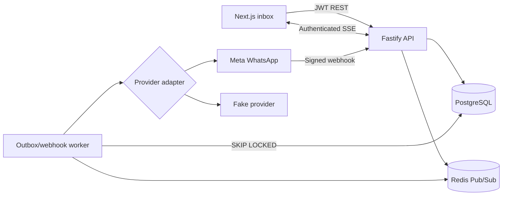

# Brixchat24

Brixchat24 is a multi-tenant WhatsApp shared inbox. Milestone 2 replaces inbox fixtures with PostgreSQL repositories and adds transactional outbound delivery, signed/idempotent webhook ingestion, Meta and fake provider adapters, and Redis Pub/Sub + SSE updates.

No Wazzup source code, logo, copy, or proprietary asset is included.

## Milestone 2 architecture



The API never waits for Meta while handling a message request. It commits the pending message and its outbox job together; the worker owns provider I/O. PostgreSQL remains the source of truth when Redis or a process restarts.

The approved implementation spec is [docs/MILESTONE-2-SPEC.md](docs/MILESTONE-2-SPEC.md). The broader data model and authorization background is in [docs/ARCHITECTURE.md](docs/ARCHITECTURE.md).

## Requirements

- Node.js 22+
- pnpm 11+
- Docker Desktop with a healthy Linux engine

## Local setup

```bash
cp .env.example .env
pnpm install
pnpm docker:up:infra
pnpm db:migrate
pnpm db:seed
pnpm docker:up
```

Open `http://localhost:3300`; the API is `http://localhost:4400`.

Development login:

- Email: `owner@brixchat.local`
- Password: `BrixChatDemo!2026`

These credentials and local Docker secrets are development-only.

## Repository layer

Tenant-aware repositories live in `packages/database/src/repositories`:

- `OrganizationRepository`, `ChannelRepository`, and `ContactRepository`
- `ConversationRepository` and `MessageRepository`
- `WebhookEventRepository`, `OutboxRepository`, and `MessageStatusRepository`
- `WorkerRepository` for concurrency-safe delivery and webhook processing

Routes receive `organizationId` from the verified JWT. They do not accept it from query/body data and do not contain SQL. Conversation and message lists use opaque base64url cursors. Agent queries are constrained by assignment; owner/admin queries cover the tenant.

## Transactional outbox and worker

Outbound flow:

1. `POST /api/v1/conversations/:id/messages` validates JWT/RBAC, tenant, channel, idempotency key, and the WhatsApp window.
2. One transaction writes `messages(status=pending)`, `outbox_jobs`, and flow events.
3. The worker claims one due job with `FOR UPDATE SKIP LOCKED` and a stale-lock timeout.
4. The provider returns a provider message ID; only then are the message and job marked `sent`/`completed`.
5. Redis publishes `message.status_changed`; the inbox refetches immediately and also polls as a missed-event fallback.

Retry schedule is 5 seconds, 30 seconds, 2 minutes, and 10 minutes. A fifth attempt or a permanent provider error moves the job to `dead_letter`; permanent failures mark the message `failed`. HTTP 429/5xx, timeouts, and network errors are retryable. Authentication, validation, unsupported type, and window errors are permanent and exposed only as normalized codes.

## Provider adapters

`packages/integrations/src/messaging` defines `MessagingProvider`. Implementations:

- `FakeMessagingProvider`: deterministic provider IDs, configurable latency, success, temporary error, and permanent error.
- `MetaWhatsAppCloudProvider`: configurable Graph API version, text messages, AbortController timeout, response ID extraction, and normalized/redacted errors.

Use fake mode locally:

```env
MESSAGING_PROVIDER_MODE=fake
FAKE_PROVIDER_MODE=success
```

Production mode:

```env
MESSAGING_PROVIDER_MODE=meta
META_WHATSAPP_API_VERSION=v25.0
```

Global Meta values are a local fallback. A multi-tenant Meta channel reads its encrypted credential envelope from PostgreSQL.

## Encrypted channel credentials

Generate a 32-byte base64 key and keep it outside source control:

```powershell
[Convert]::ToBase64String((1..32 | ForEach-Object { Get-Random -Maximum 256 }))
```

Set `DATABASE_URL`, `APP_ENCRYPTION_KEY`, `CHANNEL_ID`, `META_WHATSAPP_ACCESS_TOKEN`, `META_WHATSAPP_APP_SECRET`, and `META_WHATSAPP_VERIFY_TOKEN` in the process environment, then run:

```bash
pnpm channel:credentials:set
```

The command stores an AES-256-GCM envelope and a SHA-256 verify-token hash; it never prints secret values. API responses expose only credential/configuration booleans. In fake mode the seed intentionally stores no credential.

## Meta webhook setup

Channel-scoped public endpoints avoid exposing the internal database ID:

```text
GET  /webhooks/meta/whatsapp/:channelPublicId
POST /webhooks/meta/whatsapp/:channelPublicId
```

GET requires `hub.mode=subscribe`, a timing-safe verify-token match, and returns `hub.challenge` as plain text. POST preserves the raw request body and verifies `X-Hub-Signature-256` using HMAC SHA-256 before any event is inserted.

Each entry/change gets a deterministic SHA-256 event key. `(provider, provider_event_key)` is unique, so replay returns HTTP 200 as a duplicate without creating another message. The endpoint stores the JSONB event and returns quickly; the worker creates contacts/conversations/messages and advances status events. Raw webhook payloads contain PII and require a production retention/deletion policy.

### Public local URL

Expose port 4400 with a tunnel and configure the channel URL in Meta:

```bash
ngrok http 4400
# or
cloudflared tunnel --url http://localhost:4400
```

Example callback:

```text
https://your-tunnel.example/webhooks/meta/whatsapp/00000000-0000-4000-8000-000000000022
```

Never expose a local channel using the demo secrets.

## Webhook simulator

The simulator emits Meta-shaped JSON and a real HMAC signature:

```bash
pnpm webhook:simulate:incoming
pnpm webhook:simulate:status
```

Optional environment inputs include `SIMULATOR_CHANNEL_PUBLIC_ID`, `SIMULATOR_PHONE`, `SIMULATOR_NAME`, `SIMULATOR_TEXT`, `SIMULATOR_PROVIDER_MESSAGE_ID`, `SIMULATOR_TIMESTAMP`, and `SIMULATOR_STATUS`. Reuse message ID and timestamp to replay the exact event and verify deduplication.

## Realtime

`GET /api/v1/realtime?access_token=...` verifies the JWT, subscribes only to `brixchat:<organizationId>`, and streams SSE events with `eventId`, `eventType`, tenant/entity IDs, ISO time, and payload version. The SSE route suppresses request logging because the browser EventSource token is in the query string.

The frontend shows `Connected`, `Reconnecting`, or `Offline`, reconnects after failures, ignores repeated event IDs, and refetches the conversation/message cache every three seconds so a connection race cannot leave optimistic state stale.

## Message states and 24-hour window

Supported delivery states are `pending`, `sent`, `delivered`, `read`, and `failed`. Status rank is monotonic (`pending < sent < delivered < read`), so an out-of-order delivered event cannot downgrade read. Status events have a deterministic unique key.

An inbound provider message sets `customer_service_window_expires_at` to provider timestamp + 24 hours. Free-form outbound text after expiry is rejected by the backend with `WHATSAPP_TEMPLATE_REQUIRED`; the inbox explains that template messages arrive in Milestone 3.

## Channel health

Owner/admin endpoints:

```text
GET  /api/v1/channels
GET  /api/v1/channels/:id/health
POST /api/v1/channels/:id/test
```

Responses report credential and phone-number configuration, provider mode, last webhook/success/error, and channel state without returning secrets. A live Meta network/token probe requires real credentials; fake mode reports the deterministic local provider state.

## Database migrations

- `0000_milestone_one.sql`: initial tenant/inbox model.
- `0001_live_messaging.sql`: provider fields, message idempotency/status metadata, webhook events, flow/status events, and production outbox locking/retry fields.

Run migrations and the idempotent synthetic seed:

```bash
pnpm db:migrate
pnpm db:seed
```

## Tests and quality gates

```bash
pnpm lint
pnpm typecheck
pnpm test
pnpm build
pnpm test:e2e
pnpm docker:up
```

Unit tests cover phone normalization, HMAC/timing-safe comparison, deterministic keys, monotonic status, retry timing, provider error classification, AES-GCM, the 24-hour window, and fake-provider outcomes. API integration tests use PostgreSQL for real lists, tenant/agent isolation, atomic message+outbox creation, client idempotency, webhook signature/replay, and the closed window. Playwright uses Chromium and the fake provider for login, send, provider completion, signed inbound webhook, realtime UI state, and incoming rendering.

## Docker services

Compose uses the fixed `brixchat24-live` project name and starts PostgreSQL on 5434, Redis on 6381, API on 4400, web on 3300, and the worker. Use `pnpm docker:doctor` before troubleshooting and `pnpm docker:ps` for health. The guarded `pnpm docker:*` commands refuse to start while another Compose project from this repository or one of its worktrees is still present. Health checks validate PostgreSQL, Redis, API database access, worker database+Redis access, and the web route. Named volumes are never deleted by the normal down command.

For split hosting such as Railway, set `NEXT_PUBLIC_API_URL` and `NEXT_PUBLIC_REALTIME_URL` before building the web image. Next.js compiles both public values into the browser bundle, so changing only a runtime variable requires a web rebuild and redeploy. Leave `NEXT_PUBLIC_API_URL` empty only when a same-origin reverse proxy forwards `/api`; a separate API should use an absolute HTTPS URL and realtime should point to its HTTPS SSE endpoint.

## Security and observability

- Tenant IDs come from JWT claims and are present in tenant-owned queries.
- Access tokens/app secrets use AES-256-GCM at rest; verify tokens are hashed.
- Authorization, cookies, credentials, provider secret fields, and message bodies are redacted; SSE query-token request logging is disabled.
- Provider errors returned to the UI are normalized.
- `message_flow_events` and status/webhook tables provide durable trace evidence.
- Webhook payload retention, production key management, and secret rotation must be defined before go-live.

## Troubleshooting

- `WHATSAPP_TEMPLATE_REQUIRED`: send an approved template (Milestone 3) or receive a new customer message to reopen the 24-hour window.
- Inbox remains `Reconnecting`: verify API CORS `WEB_URL`, Redis health, and `NEXT_PUBLIC_REALTIME_URL`; polling still reconciles state.
- Webhook returns 401: ensure the raw body is unchanged and the channel app secret matches the HMAC signer.
- Webhook returns duplicate: expected for an identical replay; inspect `provider_webhook_events`.
- Outbox is retry/dead-letter: inspect normalized `last_error`, message flow events, and provider mode without printing credential/payload values.
- Docker image builds are slow: the current monorepo Dockerfiles copy the workspace before install, so lockfile/source changes can repeat supply-chain metadata checks. BuildKit cache prevents package data loss but registry latency can still dominate.
- Docker engine/named-pipe errors: start Docker Desktop and wait for the Linux engine.

## Milestone 3 production authentication

Authentication uses Argon2id credentials in `user_credentials`, 15-minute access JWTs, and opaque 256-bit refresh tokens stored only as SHA-256 hashes. The refresh token is delivered through an HttpOnly cookie, rotated on every refresh, and grouped into a family. Reuse of a replaced token revokes that complete family. Password reset, email verification, and organization invitation tokens are also hashed, expiring, and single-use.

Development login is `owner@brixchat.local` / `BrixChatDemo!2026`; it is created only by the development seed. The login form prefills it only when both `NEXT_PUBLIC_DEMO_LOGIN_EMAIL` and `NEXT_PUBLIC_DEMO_LOGIN_PASSWORD` are explicitly set in a development build; production ignores these variables and renders empty fields. Register at `/register`, complete the resumable workspace flow at `/onboarding`, and use `/forgot-password` for a generic enumeration-safe reset response. `EMAIL_PROVIDER=console` is the token-redacting local adapter. Production uses `EMAIL_PROVIDER=smtp` with `SMTP_HOST`, `SMTP_PORT`, `SMTP_SECURE`, optional credentials, and `EMAIL_FROM`; console delivery is rejected when `NODE_ENV=production`.

Cookie settings are controlled by `COOKIE_SECURE`, `COOKIE_SAME_SITE`, and `COOKIE_DOMAIN`. Local HTTP uses `COOKIE_SECURE=false`; production HTTPS should use `true`. Password changes revoke other sessions. Profile and active session controls are available under Settings → Security. Full MFA remains a future feature behind the documented placeholder.

## Organizations, invitations, teams, and roles

Onboarding creates the organization, owner membership, and initial team transactionally. Owners/admins can invite users, manage teams, and change roles through `/app/team`. Invitation tokens expire after seven days and are bound to the invited normalized email and organization. The API prevents suspension, removal, or demotion of the final active owner. UI visibility is advisory; every mutation is authorized in the API.

## Channel management and credential security

`/app/channels` supports fake and Meta channel creation, safe updates, enable/disable, health tests, template sync, public-ID rotation, verify-token rotation, and webhook setup information. Access token and app secret fields are write-only; blank updates preserve existing values. Credentials remain AES-256-GCM envelopes using `APP_ENCRYPTION_KEY`, while verify tokens are one-way hashes. API responses expose only configured flags.

Fake health is deterministic. Meta health calls the configured Graph API phone profile and normalizes configuration, authentication, permission, timeout, and network failures. Raw Meta errors are never returned. Because this repository has no supplied live Meta token, business account, or public callback, real Meta delivery and synchronization are explicitly not claimed as verified.

## Template sync and send

Run Template sync on a channel card. The adapter paginates provider templates, upserts by channel/name/language, replaces normalized variables, archives provider-removed templates, and records `template_sync_runs` plus audit events. Only approved templates matching the conversation channel can be sent. Variable positions are validated before one transaction creates the pending template message, outbox job, flow events, and template send event. The worker calls `sendTemplate`; template delivery is allowed outside the 24-hour free-text window.

Fake mode supplies approved, pending, and rejected fixtures. Select a closed-window conversation in Inbox, choose Template, fill variables, preview, and send. Configure `FAKE_PROVIDER_MODE` as `success`, `temporary_error`, `permanent_error`, `auth_failure`, `token_expired`, or `permission_denied` to exercise failure handling.

## Quick replies

`/app/quick-replies` provides organization and personal reply management; the API also supports team scope. Shortcuts are case-insensitively unique within their scope. In Inbox, type `/` to search accessible replies by shortcut/title. Selection renders allow-listed contact, agent, organization, and conversation variables, inserts editable text without auto-sending, and records usage. Unknown or missing variables are returned explicitly.

## Audit, notifications, and rate limits

Authentication/security events, invitations, role changes, team/channel operations, credential mutations, health tests, template synchronization, and quick-reply mutations write safe audit metadata including actor, organization, IP, and user agent. Secrets and message bodies are excluded. Durable in-app notifications support invitation acceptance, account state, channel/template, and session events. Authentication, invitation, channel test, credential, and sync endpoints use scoped Fastify rate limits with the shared error envelope.

## Milestone 3 migration and tests

- `0002_auth_channels_templates_quick_replies.sql`: credentials/sessions/tokens, onboarding/invitations/team membership, channel health, templates/sync/send history, scoped quick replies, notifications, and audit request context.
- Unit coverage includes Argon2id, token hashing/reuse decisions, credential merging, template variable validation, quick-reply rendering, provider failure scenarios, and all M1/M2 utilities.
- API integration coverage includes register/onboarding, refresh rotation/reuse, channel RBAC/secret hiding/health, fake template synchronization, quick-reply tenant isolation, and all retained M2 message/webhook tests.
- Playwright contains the retained live-messaging flow plus authentication/channel setup and template/quick-reply scenarios.

Run the full acceptance sequence from the repository root:

```bash
pnpm install --frozen-lockfile
pnpm db:migrate
pnpm db:seed
pnpm lint
pnpm typecheck
pnpm test
pnpm test:e2e
pnpm build
pnpm docker:up
```

## Troubleshooting Milestone 3

- Refresh loops: verify CORS origin, browser cookie acceptance, `COOKIE_SAME_SITE`, and HTTPS/`COOKIE_SECURE` alignment.
- `encryption_key_missing`: provide one base64-encoded 32-byte `APP_ENCRYPTION_KEY`; never rotate it without a credential re-encryption plan.
- `template_not_approved`: synchronize the channel and confirm current provider status and channel match.
- `template_variables_invalid`: submit exactly the component positions returned by template detail, such as `body.1`.
- `last_owner_required`: create/promote another active owner before demotion or suspension.
- Meta health configuration errors: verify Phone Number ID, Business Account ID, access token permissions, Graph version, and public webhook separately.

## Known production boundaries

Real Meta credentials and a public callback were not supplied, so no claim is made that Graph API health, external template synchronization, or phone delivery succeeded. Live SMTP delivery, production secret-manager/KMS custody, formal PII retention, full MFA, campaign broadcasting, and Meta template creation/approval submission remain manually unverified or outside Milestone 3.

## Milestone 4: Bitrix24 and conversation operations

Milestone 4 adds a provider-neutral CRM boundary with `Bitrix24Provider` and `FakeBitrix24Provider`. Bitrix24 remains the source of truth for contacts, leads, deals, pipelines, stages, and CRM responsible users. Brixchat24 stores only encrypted connection data, local/external mappings, cached display context, idempotent webhook events, and asynchronous synchronization jobs; it does not create an internal CRM or sales pipeline.

Open `/app/integrations/bitrix24` to connect a portal through OAuth, an incoming webhook, or deterministic fake mode. The settings, mappings, users, sync, and logs tabs expose health, user mapping, pipeline cache, retry/dead-letter jobs, and redacted operational logs. Wazzup's public Bitrix product behavior was used only as a product reference for keeping CRM context close to the conversation; no Wazzup code, assets, or proprietary UI were copied.

CRM writes use a queue separate from the WhatsApp outbox. Message receipt/delivery never waits for Bitrix24. Timeline comments and responsible-user updates retry independently using capped exponential backoff; permanent failures move to `dead_letter`. Bitrix webhooks are connection-scoped, token-validated, uniquely deduplicated, persisted quickly, and processed by the worker. Redis publication is best-effort after durable local mutations, so Redis failure does not roll back notes, assignments, or statuses.

The inbox now includes cached Bitrix context, refresh/match actions, open/waiting/closed/archive/spam operations, priority/pin/mute/block APIs, manual and bulk assignment, labels, internal notes and mentions, saved views, and audited CSV/JSON export. Internal notes are never sent to WhatsApp.

Local Bitrix acceptance uses the seeded fake connection and these development-only values:

```text
Connection public ID: 50000000-0000-4000-8000-000000000002
Webhook token: local-bitrix-webhook-token-2026
```

For real OAuth, set `BITRIX24_CLIENT_ID`, `BITRIX24_CLIENT_SECRET`, `APP_ENCRYPTION_KEY`, and a public `API_PUBLIC_URL`. For incoming webhook mode, enter the Bitrix webhook URL in the UI; it is encrypted and never returned. Real Bitrix24 success is not claimed unless health, read, write, callback, and permission checks have actually completed against a supplied portal.

Migration `0003_bitrix24_and_conversation_operations.sql` contains the integration, CRM job/cache/mapping, assignment, label, note, saved-view, and operation-history models. The approved implementation contract is [docs/MILESTONE-4-SPEC.md](docs/MILESTONE-4-SPEC.md).

## Milestone 5: media, search, automations and Open Channels

Brixchat24 remains a Wazzup-like communication layer, not a CRM. Bitrix24 owns contacts, leads, deals, companies, pipelines, tasks and sales reporting. Media, shared-inbox operations, bounded message automations and optional Open Channels chat/session synchronization live in Brixchat24. WhatsApp Cloud API is the official Meta Business Platform connection and reports `groupConversations=false`. A separate, optional Baileys-based WhatsApp Web linked-device adapter can be enabled with `WHATSAPP_WEB_ENABLED=true`; it is not Meta's official Cloud API and carries QR renewal, phone connectivity, session loss and account-restriction risks. Keep it disabled until the linked-device acceptance checklist and production backup gate are complete.

Incoming media creates a pending attachment and worker job. The worker enforces size, MIME/magic-byte and filename policies, calculates SHA-256, scans through `MalwareScanner`, and writes an organization-scoped unpredictable key to private storage. Downloads require authorization and a short signed URL; infected/deleted media is denied and audited. Local storage and Noop scanning are development-only; the provider contract permits S3-compatible production adapters.

Tenant-scoped PostgreSQL full-text/trigram search covers contacts, phone, messages, notes, filenames and cached Bitrix context. The API returns safe highlight segments, never raw headline HTML. Searchable plaintext means database encryption and access controls must protect message text; randomized application encryption would require a separate blind-index design.

Automation is a versioned Trigger → Conditions → Actions engine. Domain events enter a durable outbox and workers create deduplicated runs/steps. Depth/action/rate limits, correlation IDs, permission snapshots, WhatsApp-window rules and SSRF allowlisting prevent loops and policy bypass. Message actions reuse the transactional outbox and CRM actions reuse CRM queues.

Bitrix supports `crm_context`, `open_channels`, and `both`. Timeline and Open Channels queues/mappings stay separate. In `both`, `session_summary` is the default conflict policy and unique source markers prevent duplicates. The fake connector supports deterministic local acceptance; real Open Channels requires observed portal events.

Use `/health/live`, `/health/ready`, authenticated `/health/dependencies`, and API-key-protected `/metrics`. Tenant retention supports legal hold and dry-run. See [production checklist](docs/PRODUCTION-CHECKLIST.md), [runbook](docs/RUNBOOK.md), and `docker-compose.production.yml` for TLS/domains, PITR, object versioning, key backup, RPO/RTO and restore drills. Real Meta media/delivery, real Bitrix Open Channels, public HTTPS, production storage/scanning, backup and restore are not claimed without evidence.
