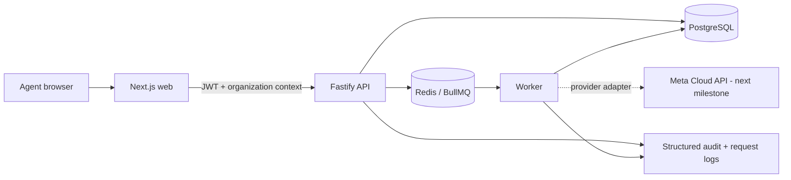
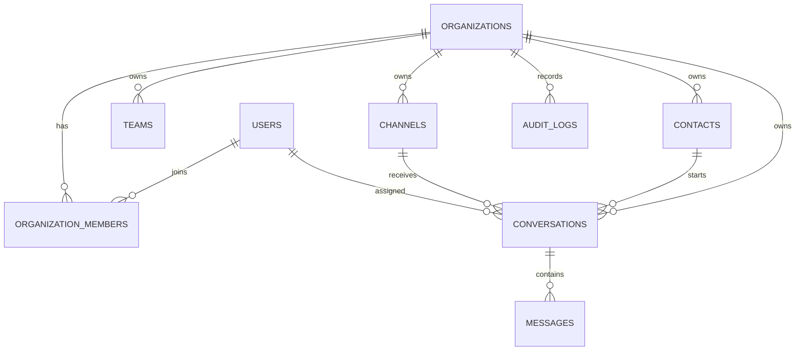
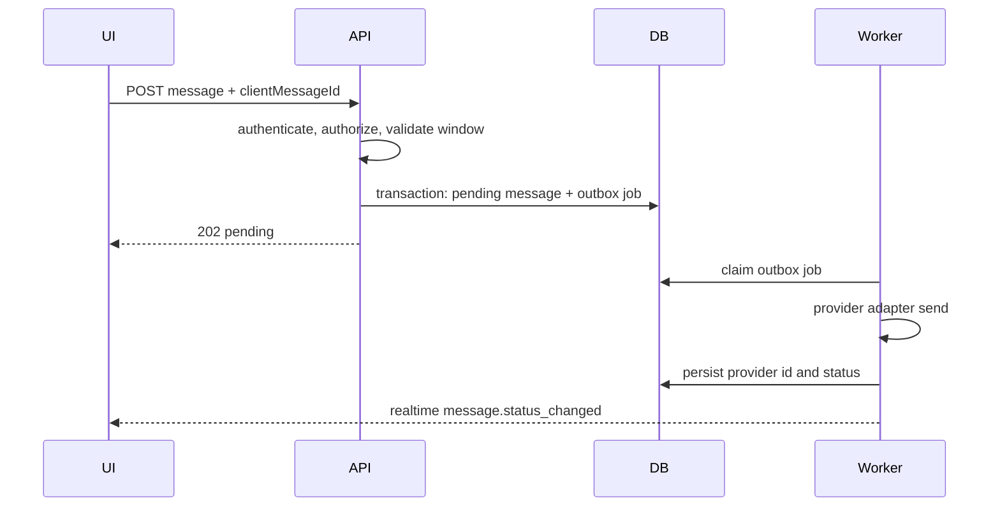
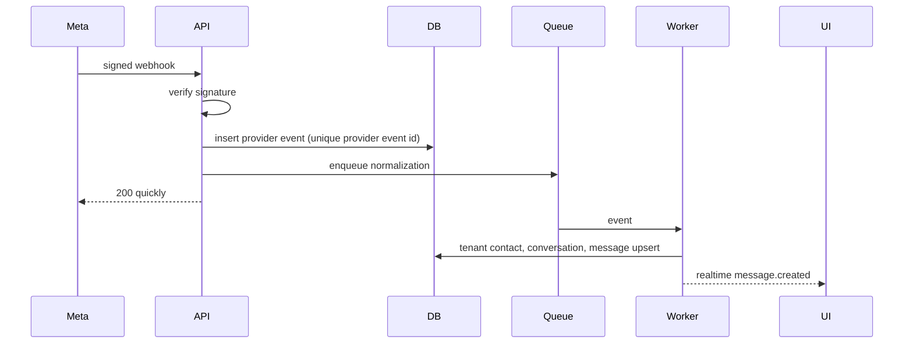

# Brixchat24 Milestone 1 Architecture

## Repository analysis

The repository contained only Git metadata before initialization. Milestone 1 therefore establishes the product's architectural boundaries instead of adapting a legacy runtime. The browser never accesses PostgreSQL directly. Every tenant-scoped command crosses the API authorization layer and every query requires an `organizationId`.

## System architecture



## Monorepo

```text
apps/web       Next.js dashboard and inbox
apps/api       Fastify REST API and tenant authorization
apps/worker    BullMQ worker boundary
packages/auth  JWT claims, roles, and permission policy
packages/database Drizzle schema, migration, and seed
packages/shared Domain contracts and demo fixtures
packages/validation Zod request contracts
packages/ui     Reusable UI primitives
packages/config Environment parsing
packages/integrations Provider contracts
packages/observability Structured logging contracts
```

## ER model



## Outbound message sequence



## Inbound webhook sequence



## Authorization matrix

| Capability          | Owner | Admin | Team lead |    Agent |    Viewer |
| ------------------- | ----: | ----: | --------: | -------: | --------: |
| View inbox          |   All |   All |      Team | Assigned | Read only |
| Send message        |   Yes |   Yes |       Yes | Assigned |        No |
| Assign conversation |   Yes |   Yes |      Team |       No |        No |
| Manage members      |   Yes |   Yes |        No |       No |        No |
| Manage channels     |   Yes |   Yes |        No |       No |        No |
| View reports        |   Yes |   Yes |      Team |      Own |        No |
| Billing             |   Yes |    No |        No |       No |        No |

Backend policy checks are authoritative; UI visibility is only a convenience.

## Development phases

1. Foundation: repository, tenant identity, RBAC, dashboard, inbox, migration and seed.
2. Messaging core: provider adapter, webhook inbox, outbox, delivery state machine and realtime.
3. CRM: contacts, custom fields, pipelines, deals and deduplication.
4. Operations: templates, automation, tasks, notifications and channel health.
5. Growth: consent-safe campaigns, analytics, integrations and billing limits.
6. Production hardening: load tests, disaster recovery, security review and deployment gates.

## Risks and controls

- Tenant data leakage: mandatory organization-scoped repository methods plus isolation tests.
- Duplicate provider events: unique idempotency constraints and raw event ledger.
- WhatsApp policy drift: provider policy module and backend-enforced messaging window.
- Secret exposure: encrypted credential envelope and redacted structured logs.
- Queue divergence: transactional outbox, exponential retry and dead-letter inspection.
- Health-data sensitivity: tenant-defined fields, access audit, retention and export/delete workflows.
- Local Docker availability: acceptance records infrastructure failures separately from application failures.

## Milestone 1 file changes

Milestone 1 creates the workspace manifests, three runnable apps, shared packages, initial SQL migration and deterministic seed, tenant-aware auth/RBAC endpoints, dashboard/inbox UI, tests, Docker Compose, environment template and operational README.
